# Enterprise LMS Database Schema

This document describes the first implementation-ready database layer for the Enterprise Learning Management System prototype.

The implementation schema is in [`prisma/schema.prisma`](../prisma/schema.prisma). It targets PostgreSQL through Prisma ORM and uses UUID primary keys, foreign keys, uniqueness constraints, and lookup tables for configurable business records. The original SQL export remains in [`database/001_initial_schema.sql`](../database/001_initial_schema.sql) as a reference version of the same normalized model.

## Design Principles

- Normalize core LMS data so each concept has one owner table.
- Keep configurable business data in tables, not hard-coded enums.
- Use enums only for stable workflow states such as `draft`, `published`, `completed`, and `issued`.
- Keep historical records instead of deleting business-critical data.
- Use join tables for many-to-many relationships such as users and roles, programs and courses, cohorts and members, course target audiences, and quiz templates and questions.
- Use JSONB only where the data is genuinely flexible, such as certificate layout configuration, report filters, and answer payloads for complex question types.

## Major Domains

### 1. Organization And Workforce

Core tables:

- `organizations`
- `departments`
- `work_units`
- `job_titles`
- `competency_gap_areas`
- `users`
- `roles`
- `user_roles`

These tables support the HR/admin flows where departments, work units, job titles, and competency gaps can be managed instead of being locked to a dropdown list.

### 2. Catalog Configuration

Core tables:

- `course_categories`
- `course_levels`
- `content_types`
- `question_types`
- `external_providers`
- `external_provider_tracks`

These tables power the Configuration Center. If HR disables a content type or question type, the creator side should read from these tables and only show allowed options.

### 3. Courses And Content

Core tables:

- `courses`
- `course_target_departments`
- `course_target_work_units`
- `course_target_job_titles`
- `course_versions`
- `course_chapters`
- `course_content_items`
- `content_item_attachments`
- `course_reviews`
- `course_review_comments`
- `moderation_flags`

Important relationships:

- A course belongs to one organization.
- A course may have one category and one level.
- A course has many chapters.
- A chapter has many content items.
- A content item can have many attached documents or links.
- Target audience is normalized into separate target tables instead of storing comma-separated values.

### 4. Course Templates

Core tables:

- `course_templates`
- `course_template_chapters`
- `course_template_content_items`

These support reusable course creation templates. A creator can start from a company template, edit the copy, and save it as a new course without changing the original template.

### 5. Programs, Cohorts, And Program Templates

Core tables:

- `program_types`
- `programs`
- `program_courses`
- `program_cohorts`
- `program_cohort_members`
- `program_tasks`
- `program_milestones`
- `program_templates`
- `program_template_courses`
- `program_template_tasks`
- `program_template_milestones`

Important relationships:

- Program types can be active, archived, or retired.
- Retired program types remain available historically but should not appear during new program creation.
- Programs can target departments, work units, and job titles.
- Programs can have multiple cohorts with separate start dates.
- HR can save and reuse program templates with target audience, duration, task list, courses, and milestones.

### 6. Quizzes, Question Bank, And Attempt Policies

Core tables:

- `attempt_scoring_policies`
- `attempt_scoring_policy_rules`
- `question_bank_questions`
- `question_options`
- `question_matching_pairs`
- `question_ordering_items`
- `quiz_templates`
- `quiz_template_questions`
- `quizzes`
- `quiz_questions`
- `quiz_attempts`
- `quiz_answers`

This supports:

- Multiple question types
- HR-configurable question types
- Reusable quiz templates
- Pre-course assessments
- Chapter quizzes
- End-of-course quizzes
- Post-course assessments
- Attempt-based scoring policies
- Quiz completion XP and quiz performance XP

### 7. Enrollment And Progress

Core tables:

- `course_enrollments`
- `content_progress`
- `program_enrollments`

These tables separate enrollment from progress. This allows reports such as:

- Completed courses
- Pending courses
- Completion percentage
- Time spent
- Last video position
- Attempts
- Learner-level progress reports

### 8. Assignments And Surveys

Core tables:

- `assignments`
- `assignment_submissions`
- `assignment_submission_files`
- `assignment_peer_reviews`
- `surveys`
- `survey_questions`
- `survey_question_options`
- `survey_responses`
- `survey_answers`

Assignments support file, text, and link submissions. Surveys support question sets and anonymous response behavior.

### 9. Certificates And External Credentials

Core tables:

- `certificate_templates`
- `certificate_template_signers`
- `issued_certificates`
- `external_certificates`

The certificate designer and signer management live in Certificate Management. Issued certificates are stored separately from templates so template changes do not rewrite historical certificates.

### 10. XP, Gamification, And Leaderboards

Core tables:

- `learning_levels`
- `xp_rules`
- `xp_events`
- `user_xp_summaries`
- `leaderboard_rules`
- `leaderboard_snapshots`
- `leaderboard_entries`

XP is event-based. The system records each XP event, then derives the learner summary and leaderboard snapshots from those events.

### 11. TNA, Approvals, Notifications, Reports, Audit

Core tables:

- `tna_requests`
- `approval_workflows`
- `approval_workflow_steps`
- `approval_requests`
- `approval_actions`
- `notification_settings`
- `notifications`
- `saved_reports`
- `report_runs`
- `dashboard_widgets`
- `audit_logs`

These support HR approvals, TNA requests, notifications, dashboards, exports, and auditable admin changes.

## High-Level ERD

```mermaid
erDiagram
  ORGANIZATIONS ||--o{ USERS : has
  ORGANIZATIONS ||--o{ COURSES : owns
  ORGANIZATIONS ||--o{ PROGRAMS : owns
  ORGANIZATIONS ||--o{ COURSE_CATEGORIES : configures
  ORGANIZATIONS ||--o{ COURSE_LEVELS : configures
  ORGANIZATIONS ||--o{ CONTENT_TYPES : configures
  ORGANIZATIONS ||--o{ QUESTION_TYPES : configures

  USERS ||--o{ USER_ROLES : has
  ROLES ||--o{ USER_ROLES : grants
  USERS ||--o{ COURSE_ENROLLMENTS : enrolls
  USERS ||--o{ PROGRAM_ENROLLMENTS : joins
  USERS ||--o{ QUIZ_ATTEMPTS : attempts
  USERS ||--o{ XP_EVENTS : earns
  USERS ||--o{ ISSUED_CERTIFICATES : receives

  COURSE_CATEGORIES ||--o{ COURSES : classifies
  COURSE_LEVELS ||--o{ COURSES : grades
  COURSES ||--o{ COURSE_CHAPTERS : contains
  COURSE_CHAPTERS ||--o{ COURSE_CONTENT_ITEMS : contains
  COURSE_CONTENT_ITEMS ||--o{ CONTENT_ITEM_ATTACHMENTS : has
  COURSES ||--o{ COURSE_ENROLLMENTS : has
  COURSE_ENROLLMENTS ||--o{ CONTENT_PROGRESS : tracks

  PROGRAM_TYPES ||--o{ PROGRAMS : defines
  PROGRAMS ||--o{ PROGRAM_COURSES : includes
  COURSES ||--o{ PROGRAM_COURSES : included_in
  PROGRAMS ||--o{ PROGRAM_COHORTS : groups
  PROGRAM_COHORTS ||--o{ PROGRAM_COHORT_MEMBERS : contains
  PROGRAMS ||--o{ PROGRAM_TASKS : schedules
  PROGRAMS ||--o{ PROGRAM_MILESTONES : tracks

  QUESTION_TYPES ||--o{ QUESTION_BANK_QUESTIONS : defines
  QUESTION_BANK_QUESTIONS ||--o{ QUESTION_OPTIONS : has
  QUIZ_TEMPLATES ||--o{ QUIZ_TEMPLATE_QUESTIONS : contains
  QUESTION_BANK_QUESTIONS ||--o{ QUIZ_TEMPLATE_QUESTIONS : reused_by
  QUIZZES ||--o{ QUIZ_QUESTIONS : contains
  QUESTION_BANK_QUESTIONS ||--o{ QUIZ_QUESTIONS : used_by
  QUIZZES ||--o{ QUIZ_ATTEMPTS : receives

  CERTIFICATE_TEMPLATES ||--o{ CERTIFICATE_TEMPLATE_SIGNERS : has
  CERTIFICATE_TEMPLATES ||--o{ ISSUED_CERTIFICATES : generates
  COURSES ||--o{ ISSUED_CERTIFICATES : awards
  PROGRAMS ||--o{ ISSUED_CERTIFICATES : awards

  XP_RULES ||--o{ XP_EVENTS : calculates
  LEADERBOARD_RULES ||--o{ LEADERBOARD_SNAPSHOTS : generates
  LEADERBOARD_SNAPSHOTS ||--o{ LEADERBOARD_ENTRIES : ranks
```

## Reporting Views

The initial migration includes three views:

- `v_course_catalog`
- `v_learner_progress_report`
- `v_course_completion_report`

These directly map to prototype pages:

- Course Catalog
- Learner Progress Report
- Course-level completion and participation reports

## First API Modules To Build

Recommended implementation order:

1. Auth and role resolution
2. Organization configuration
3. Course categories, levels, content types, and question types
4. Course catalog read APIs
5. Course creation APIs
6. Enrollment APIs
7. Progress tracking APIs
8. Quiz/question APIs
9. Certificate template and issuance APIs
10. Program/cohort APIs
11. Assignment and survey APIs
12. XP, leaderboard, analytics, and reports

## Suggested Backend Stack

Recommended stack for this project:

- Backend: Node.js with NestJS or Express
- Database: PostgreSQL
- ORM/query builder: Prisma, Drizzle, or TypeORM
- File storage: local storage for development, S3-compatible storage later
- Authentication: JWT or session cookies

For this project, Prisma would be a good next step because it can generate TypeScript types from the database model and makes CRUD/API work faster.
